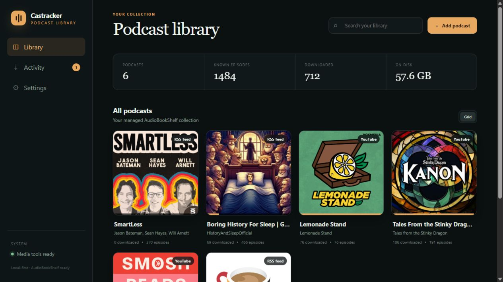
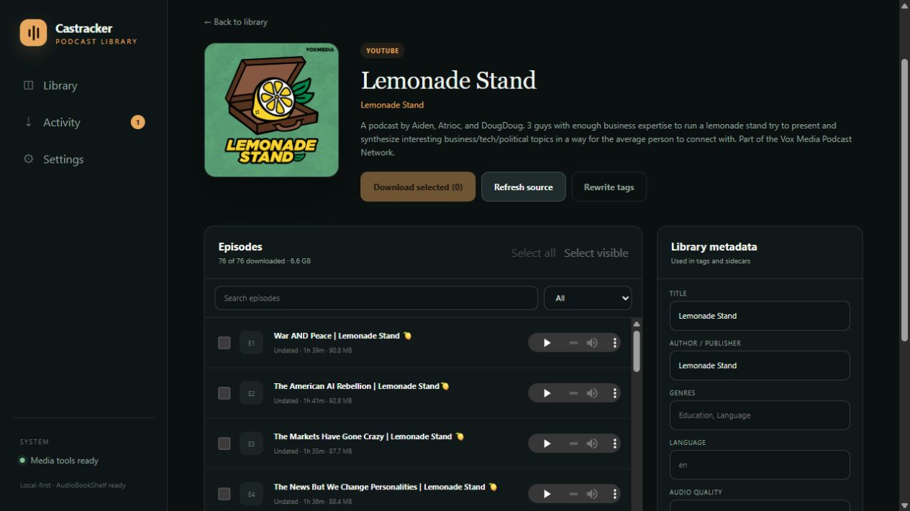
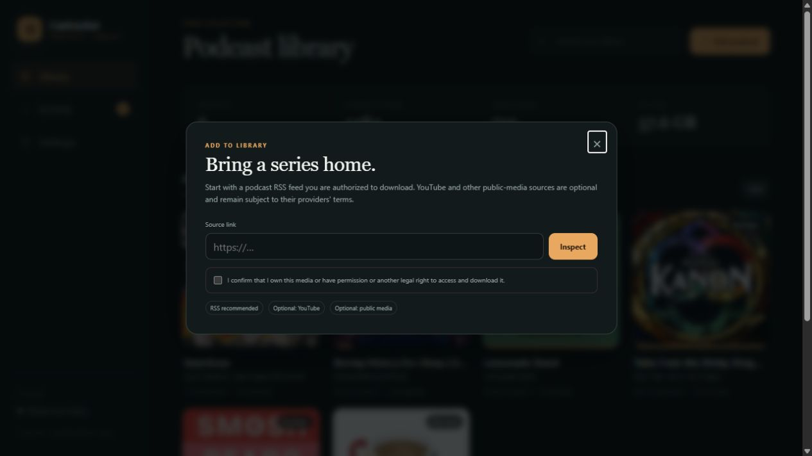

# Castracker

Castracker is a local-first podcast downloader and library manager for Windows,
macOS, and Linux. Add an authorized podcast RSS feed, choose an audio quality,
and manage the collection in an
[Audiobookshelf](https://www.audiobookshelf.org/)-compatible folder.

Optional yt-dlp integration can inspect public YouTube playlists and other
public media sources. A source being publicly reachable or technically supported
does not mean that it is licensed for downloading.

## Screenshots

### Library overview



### Podcast details



### Add a podcast



## Responsible use

Use Castracker only for media that you own or are authorized to download, such
as:

- your own uploads;
- public-domain or appropriately licensed media;
- podcast enclosures whose publisher permits downloading; or
- media for which you have the rights holder's permission or another applicable
  legal right.

Follow the source provider's terms and applicable law. Do not use Castracker to
bypass authentication, subscriptions, paywalls, digital rights management, or
other access controls. Castracker intentionally rejects private-network URLs,
embedded credentials, and entries identified as private, premium,
subscriber-only, or otherwise authentication-gated.

See [RIGHTS.md](RIGHTS.md) to report a rights concern. Castracker is an
independent project and is not affiliated with, endorsed by, or sponsored by
YouTube, Acast, Audiobookshelf, Deno, FFmpeg, yt-dlp, or any podcast publisher
or media platform.

## Requirements

| Tool                                                                | Purpose                                                           | Required                 |
| ------------------------------------------------------------------- | ----------------------------------------------------------------- | ------------------------ |
| [Deno](https://docs.deno.com/runtime/getting_started/installation/) | Runs Castracker and provides the JavaScript runtime used by yt-dlp | Yes                      |
| [FFmpeg](https://ffmpeg.org/download.html)                          | Converts audio, embeds artwork, and writes podcast tags           | For downloads            |
| [yt-dlp](https://github.com/yt-dlp/yt-dlp#installation)             | Optional public-media inspection and downloading                  | Only for non-RSS sources |

Castracker finds tools installed on `PATH`. It also recognizes portable binaries
in the ignored `.tools` directory (`.exe` on Windows and extensionless binaries
on macOS/Linux).

## Setup

Download or clone this project, open a terminal in its root folder, and follow
the section for your operating system.

### Windows

On Windows 10 or 11, install Deno and FFmpeg with
[WinGet](https://learn.microsoft.com/windows/package-manager/winget/):

```powershell
winget install --id DenoLand.Deno -e
winget install --id Gyan.FFmpeg -e
```

Install yt-dlp only if you need the optional non-RSS integration:

```powershell
winget install --id yt-dlp.yt-dlp -e
```

Close and reopen PowerShell so it receives the updated `PATH`, return to the
Castracker folder, and start the app:

```powershell
deno task start
```

The Windows launcher is also supported. It uses a portable Deno binary when
present and otherwise uses the one on `PATH`:

```powershell
.\start-castracker.ps1
```

If FFmpeg is missing, Windows users can install a verified portable build from
**Settings** or by running `.\install-ffmpeg.ps1`. The downloaded binaries stay
in the ignored `.tools` directory and are not part of this source distribution.

### macOS

Install [Homebrew](https://brew.sh/) if needed, then run:

```bash
brew install deno ffmpeg
deno task start
```

Install `yt-dlp` separately with Homebrew if you need optional public-media
support. If macOS asks whether to allow incoming connections, deny the request;
Castracker is designed for loopback-only use.

### Linux

On Debian or Ubuntu:

```bash
sudo apt update
sudo apt install -y curl ffmpeg
curl -fsSL https://deno.land/install.sh | sh
source "$HOME/.deno/env"
deno task start
```

Use your distribution's package manager to install `yt-dlp` only if you need
optional public-media support. Refer to the upstream projects for supported
installation methods and license information.

### Verify the installation

These commands print version information for installed tools:

```text
deno --version
ffmpeg -version
ffprobe -version
yt-dlp --version
```

Restart Castracker after installing a missing tool.

## Start and configure the app

```text
deno task start
```

Open [http://127.0.0.1:8787](http://127.0.0.1:8787). Press `Ctrl+C` in the
terminal to stop the app. Choose another local port when 8787 is occupied:

```text
deno task start --port 8788
```

Castracker always listens on `127.0.0.1`. It does not support LAN or public
internet exposure. The server rejects non-local Host headers and cross-origin
browser requests, and remote-source validation blocks local, private,
link-local, reserved, and multicast network destinations.

## Supported sources

| Source                    | Behavior                                                                              |
| ------------------------- | ------------------------------------------------------------------------------------- |
| Podcast RSS               | Recommended; native feed parsing, resumable enclosure downloads, and episode metadata |
| YouTube video or playlist | Optional metadata and audio through an independently installed yt-dlp                 |
| Other public media sites  | Optional sources recognized by the installed yt-dlp build                             |

Private, deleted, unavailable, unlisted, subscriber-only, premium, and other
authentication-gated entries are omitted during inspection. If an entry later
becomes inaccessible, Castracker marks it unavailable.

## Library workflow

1. Select **Add podcast**, paste an authorized source URL, confirm your rights,
   and choose **Inspect**.
2. Review the detected title, publisher, and episode count.
3. Choose an audio preset:
   - High: M4A/AAC at 160 kbps
   - Standard: MP3 at 128 kbps
   - Compact: MP3 at 64 kbps
4. Add the source without downloading, or queue a small initial selection.
5. Open the show to search episodes, download a selection, refresh its source,
   edit metadata, or rewrite tags on downloaded files.

Background work appears under **Activity**. Failed episodes can be selected
again. RSS downloads retain `.part` files when interrupted and resume when the
server supports byte ranges. Auto-download queues new items found by a manual
refresh; Castracker does not run a hidden scheduled service after the app closes.

## Audiobookshelf library

The default managed root is `castracker-library` inside the project. Point an
Audiobookshelf library with media type **Podcasts** at that folder. The root can
be changed under **Settings**; Castracker verifies read/write access and moves
its managed show folders to the new location.

Network storage must already be mounted or addressable by the current user:

- Windows: a drive path or UNC path such as `\\server\share\podcasts`
- macOS: a mounted path under `/Volumes`
- Linux: a mounted path under `/mnt`, `/media`, or another mount point

Each podcast uses a flat layout:

```text
castracker-library/
  Example Podcast [library-id]/
    cover.jpg
    desc.txt
    podcast.json
    2026-08-17 - S13E010 - Episode title [episode-id].m4a
```

Downloaded files include standard podcast title, author, genre, publication
date, season, episode, description, and embedded cover artwork. `podcast.json`
preserves the normalized record.

## Local data and repository safety

Application state is stored in `.castracker/state.json`. Managed downloads,
state, partial files, and local tools are excluded by `.gitignore` and must not
be committed or attached to a release. These files can contain listening
history, source metadata, local paths, third-party binaries, and copyrighted
media.

Before publishing a new repository or release, review both tracked and ignored
files and run a credential/secret scan. `.gitignore` does not remove data that
has already entered Git history.

## Development and tests

Run the complete verification suite:

```text
deno task verify
```

The server runs with Deno's combined `--allow-all` permission because Windows
UNC library paths cannot be used with Deno's separate read/write grants. The app
needs filesystem, network, environment, and subprocess access for user-selected
libraries, public feeds, FFmpeg, and optional yt-dlp. Keep the project, scripts,
and discovered executables in a trusted location. The loopback-only server and
remote-source checks reduce exposure but do not sandbox the process itself.

Security issues should be reported according to [SECURITY.md](SECURITY.md).
Contributions must follow [CONTRIBUTING.md](CONTRIBUTING.md).

## License and third-party software

Castracker is licensed under the GNU General Public License version 3 or, at your
option, any later version (`GPL-3.0-or-later`). See [LICENSE](LICENSE).

Deno, FFmpeg, yt-dlp, and Audiobookshelf are independent third-party projects
with their own licenses. They are not relicensed by Castracker. See
[THIRD_PARTY_NOTICES.md](THIRD_PARTY_NOTICES.md), especially before creating a
binary bundle or installer that redistributes those tools.
